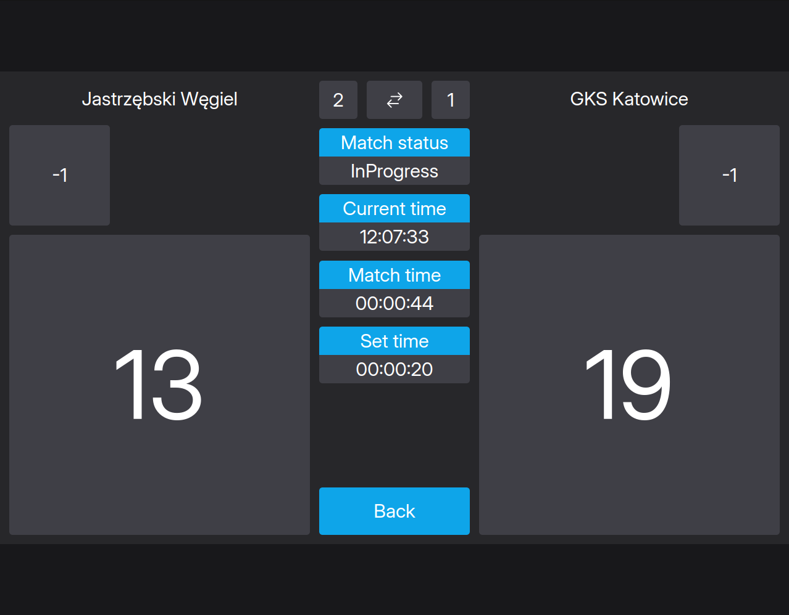
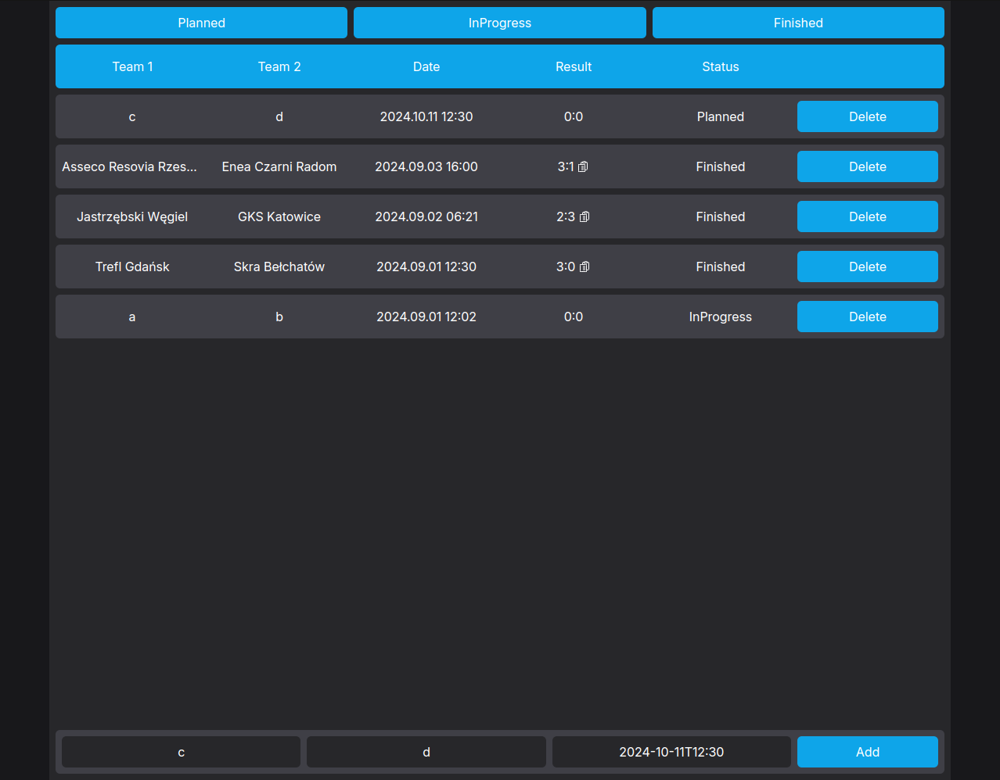

# PKI Projekt - Volleyball Scoreboard





## Architektura aplikacji

Strona wykonana jako monolityczna aplikacja SPA (Single Page Application), frontend wykorzystujący SSR (Server Side Rendering) z częściowymi, asynchronicznymi aktualizacjami zawartości strony z użyciem protokołu WebSocket.

Wykorzystane technologie:

* [Rust](https://www.rust-lang.org) - backend

* [axum](https://github.com/tokio-rs/axum) - web framework

* [sqlx](https://github.com/launchbadge/sqlx) - obsługa bazy PostgreSQL

* [maud](https://maud.lambda.xyz) - renderowanie szablonów HTML

* [htmx](https://htmx.org) - framework JavaScript, obsługa aktualizacji zawartości strony i protokołu WebSocket

* [tailwindcss](https://tailwindcss.com) - stylowanie, klasy CSS

## Uruchamianie

Program budujemy oraz wykonujemy za pomocą komendy:

```
cargo run --release
```

Program oczekuje, że zmienne środowiskowe ``PORT`` - ustawiająca numer portu na którym nasłuchuje aplikacja oraz ``DATABASE_URL`` - ustawiająca adres bazy danych PostgreSQL. Zmienne te mogą być zdefiniowane w pliku ``.env``.

Przy kompilacji, program sprawdza poprawność użytych zapytań SQL. Z tego powodu może wymagać wykonania migracji bazy. Bazę możemy zainicjalizować ręcznie za pomocą narzędzia [sqlx-cli](https://lib.rs/crates/sqlx-cli):

```
sqlx-cli database reset
```

## Linki

[REPO](https://github.com/jgrodzki/pki_projekt)

[DEPLOYMENT](https://pki-projekt.onrender.com)
